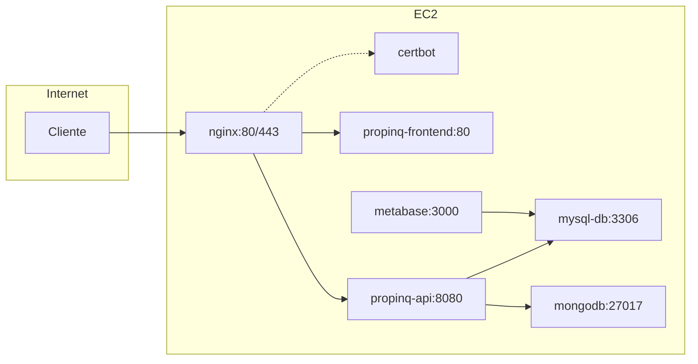

# Infra: despliegue de Propinq en producción

Infraestructura Docker para desplegar Propinq (Spring Boot + Angular) en un EC2 con Nginx como reverse proxy y HTTPS con Let's Encrypt.

---

## Arquitectura



---

## Ficheros principales

- `docker-compose.prod.yaml`: stack de producción (api, frontend, mysql, mongodb, metabase, nginx, certbot).
- `docker-compose.ssl.yaml`: stack mínimo para obtener el primer certificado (nginx + certbot).
- `.env.api`, `.env.mysql`, `.env.mongodb`, `.env.nginx`: variables de entorno por servicio.
- `nginx/prod.conf`: configuración definitiva de Nginx (HTTP + HTTPS + proxy).
- `nginx/ssl-bootstrap.conf`: config mínima solo HTTP para el bootstrap de Certbot.
- `renew_certs.sh`: script para renovar certificados y recargar nginx.

---

## 1. Preparar variables de entorno

### 1.1 Variables obligatorias para correr el proyecto

Estas variables deben tener siempre un valor válido en producción, agrupadas por fichero `.env`:

- **`.env.api`** (backend / seguridad / mail / Cloudinary):
    - `SPRING_PROFILES_ACTIVE`
    - `SECURITY_JWT_KEY`
    - `SECURITY_JWT_USER`
    - `MAIL_HOST`, `MAIL_USERNAME`, `MAIL_PASSWORD`
    - `CLOUD_NAME`, `CLOUD_API_KEY`, `CLOUD_API_SECRET`

- **`.env.mysql`**:
  - `MYSQL_DATABASE`, `MYSQL_USERNAME`, `MYSQL_PASSWORD`, `MYSQL_ROOT_PASSWORD`

- **`.env.mongodb`**:
  - `MONGO_DATABASE`, `MONGO_USER`, `MONGO_PASSWORD`

### 1.2 Ficheros `.env` por servicio

En esta carpeta debes crear/ajustar los siguientes ficheros:

- **`.env.api`** → configuración del backend (Spring Boot). Ejemplo base:

  ```env
  SPRING_PROFILES_ACTIVE=docker

  # Mail
  MAIL_HOST=smtp.gmail.com
  MAIL_PORT=587
  MAIL_USERNAME=propinq.enterprise@gmail.com
  MAIL_PASSWORD=...
  MAIL_SMTP_AUTH=true
  MAIL_STARTTLS_ENABLE=true
  MAIL_TIMEOUT=2000

  # Logging
  LOG_WEB_LEVEL=INFO
  LOG_HIBERNATE_SQL_LEVEL=WARN
  LOG_HIBERNATE_BINDER_LEVEL=WARN

  # CORS / frontend
  CORS_ALLOWED_ORIGINS=https://www.propinq.online
  FRONTEND_URL=https://www.propinq.online

  # Cloudinary
  CLOUD_NAME=...
  CLOUD_API_KEY=...
  CLOUD_API_SECRET=...

  # Swagger / OpenAPI
  SWAGGER_DISABLE_DEFAULT_URL=true
  SWAGGER_PATH=/docs
  OPENAPI_PATH=/api-docs

  # JWT
  SECURITY_JWT_KEY=...
  SECURITY_JWT_USER=AUTH0_USER

  # POI
  POI_SCHEDULER_ENABLED=false
  POI_SCHEDULER_CRON=0 30 3 * * *
  OSM_DOWNLOAD_THROTTLE_DAYS=7
  POI_RUN_ON_STARTUP=false
  POI_RUN_DOWNLOAD=true
  POI_RUN_EXTRACTION=true
  POI_REGION=south-america/argentina-latest
  POI_SCRIPTS_DIR=/app/scripts
  POI_DATA_DIR=/app/data
  POI_PBF_PATH=/app/data/argentina-latest.osm.pbf
  POI_OUT_DIR=/app/out
  POI_IMPORT_FILE=/app/out/pois.geojsonseq

  # Metabase embebido (reports)
  METABASE_SECRET_KEYL=...
  METABASE_SITE_URL=http://localhost:3000
  ```

- **`.env.mysql`** → credenciales de MySQL:

  ```env
  MYSQL_PORT=3306
  MYSQL_DATABASE=propinq
  MYSQL_USERNAME=root
  MYSQL_PASSWORD=password
  MYSQL_ROOT_PASSWORD=password
  ```

- **`.env.mongodb`** → credenciales de MongoDB:

  ```env
  MONGO_HOST=mongodb
  MONGO_PORT=27017
  MONGO_AUTH_SOURCE=admin
  MONGO_USER=mongo-user
  MONGO_PASSWORD=secret
  MONGO_DATABASE=propinq
  ```

- **`.env.nginx`** → URL pública del frontend y orígenes CORS:

  ```env
  FRONTEND_URL=https://www.propinq.online
  CORS_ALLOWED_ORIGINS=https://www.propinq.online
  ```

Ajusta los valores a tu entorno

---
## 2. Solo la primera vez desplegando el proyecto obtener el primer certificado SSL (Let's Encrypt)
Seguir los pasos en [@infra/README-SSL.md](README-SSL.md)

## 3. Nginx con HTTPS y stack de producción

2. Levanta el stack completo:

   ```bash
   cd /srv/apps/propinq/infra
   docker compose -f docker-compose.prod.yaml up -d --build
   ```

Comprobaciones rápidas:

- `https://www.propinq.online/health` → endpoint de health servido por Nginx.
- `https://www.propinq.online/` → frontend Angular.
- `https://www.propinq.online/api/v1/...` → endpoints REST de la API de Spring Boot

---

## 4. Renovación automática de certificados

Script `renew_certs.sh` :

Para que se ejecute automáticamente cada noche:

Abrir el editor de cron
```bash
crontab -e
```

Copair y pegar:

```cron
0 3 * * * /srv/apps/propinq/infra/renew_certs.sh
```

